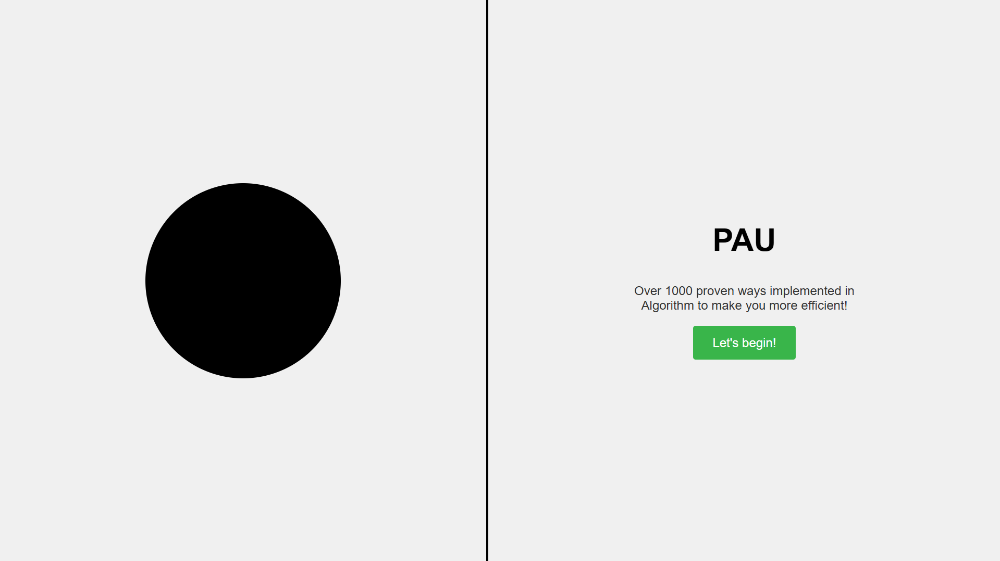

# PAU - Personal Assistant for Upskilling

**Purpose**: PAU is a **scalable**, **AI-driven**, and **human-centric** upskilling assistant designed to optimize cognitive efficiency and lifelong learning.  
It leverages **advanced AI, human psychology principles, and digital vision processing** to enhance knowledge acquisition, retention, and productivity.

---

## Why am I Building PAU ?

I always imagined a system that could **keep track of me** and **make me more efficient**. As I grew older, I **needed this system even more**, but I could never find anything that did exactly what I wanted.

Most systems were either **too restrictive** or **too invasive**—I wanted something that **helped me stay productive** but also **gave me space** to open up without worrying about privacy.

Since I couldn’t find such a system, I decided to **build it from scratch**—not just for me, but for **people like me** who juggle work, learning, and personal growth.

I have a **startup to run**, and PAU **helps me every day** in my work. It is **taking time** to shape things properly, but I believe that **any project given enough time happens**. PAU is not just a tool—it's a **personal companion for growth, efficiency, and better decision-making**.

### Note:

The current system is barebone for me to test my theory. Any suggestions would be highly appreciated. You can join the Discord channel for regular updates and feature requests:
https://discord.gg/mHxT34Va

## COMING SOON

### Features

Chatbot with Multi-Level Memory

Supports short-term, long-term, and flash memory, all stored locally.
Behavior can be customized based on user preferences.
Advanced Knowledge Base

Allows similarity-based search for efficient information retrieval.
Digital Vision

Captures and stores everything you see while developing or studying PAU in a dedicated knowledge folder.
Graph-Based Memory Relations

Implements a logical, graph-based approach to memory organization for better context and connectivity.
